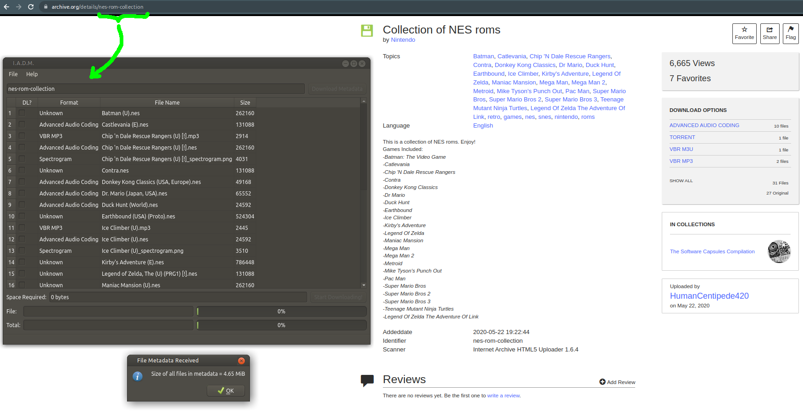

# Internet_Archive_Download_Manager
Provides a GUI to help manage downloading files from Internet Archive

Work in progress

# Build Instructions

You will need to install build-essential (or equivalent), Qt, and git

```
git clone https://github.com/mwales/Internet_Archive_Download_Manager
cd Internet_Archive_Download_Manager
mkdir build
cd build
qmake ../src/src.pro
make -j12
```

# Running / Using

You will need to download the Internet Archive binary downloading tool itself.

Per the [directions from archive.org](https://archive.org/services/docs/api/internetarchive/installation.html#binaries)

```
curl -LOs https://archive.org/download/ia-pex/ia
chmod +x ia
```

Run Internet Archive Download Manager

```
./iadm
```

Open the configuration settings and tell IADM where the ia tool you just downloaded is located.

Search for an archive / collection of files on archive.org

Cut and paste the collection name from the URL of your browser into the collection name in IADM.



Select which files you want to download (put a check next to each file you want to download), then click download.
